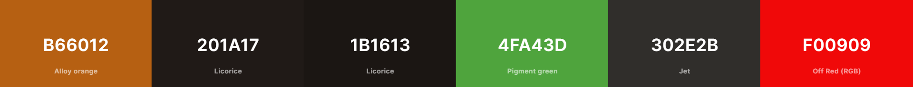

# Colour guide

## What is it

The following document will contain the color schema for the frontend app. It
was created in accordance with
[Material Design Language](https://m3.material.io/). It may also be used in
other parts of the project, such as pster or physical design.

## Color scheme

# HEX codes:

- Primary: B66012
- Backgroud: 201A17
- Surface: 1B1613
- Green: 4FA43D
- Surface_err: 302E2B
- Red: F00909

## When to use what

### Primary

Use for important information, such as graphs, login/logout buttons and other.

### Background

Self explenatory, use for a general background.

### Surface

Use as a background for various containers.

### Green

Use to signalise the operations succeeding and in graphs.

### Surface_err

Use as a background for error/warning messages

### Red

Use for the error/warning text itself and in graphs.

## How to use in Tailwind CSS

In order to use a specific color, type <b>dtap-[color]</b>

# Font

Use Montserrat where possible. In case it cannot be used, please utilize Sans
Serif.

# Rounded edges (border radius)

Border radius of 9999px (border-full) is to be used for buttons.

Border radius of 16px (border-2xl) is to be used for surfaces.
